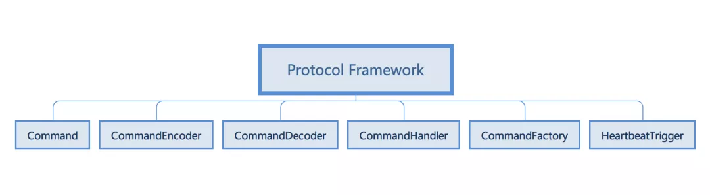
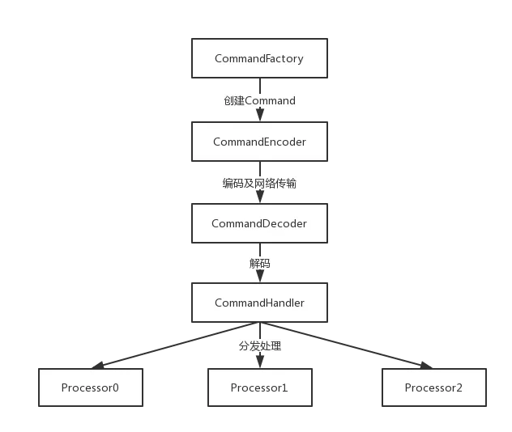
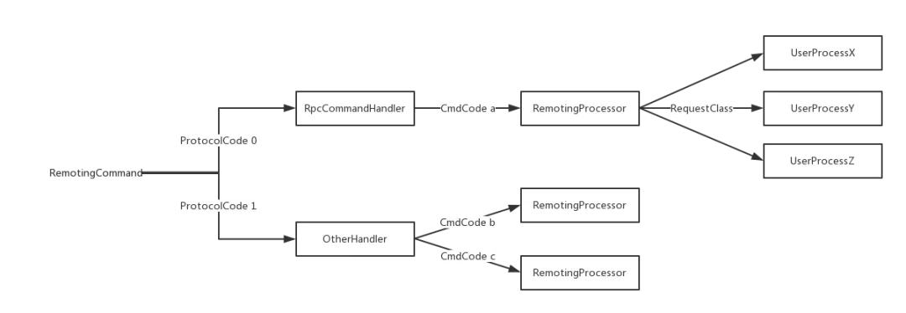

`协议框架整体如下：`

- Command：协议命令，通讯数据的顶层抽象。从交互的角度可以分为Request（请求）与Response（响应），从功能的角度，分为负载命令（交换业务数据）和控制命令（进行系统的管理、协调等）。
- CommandEncoder/CommandDecoder：协议命令的编解码器，自定义协议实现的基础，编解码器完成对象和字节数组之间的相互转换。
- CommandHandler：协议命令的处理器，命令处理入口，负责分发、处理命令。
- CommandFactory：协议命令工厂类，负责创建协议命令对象。
- HeartbeatTrigger：心跳的处理器，用户用户拓展特定的心跳机制的处理。

下面以 SOFABolt 中默认实现的 RPC 协议为例来介绍 SOFABolt 协议框架的实现。
#### 请求的处理流程
一个请求处理流程大致如下：
通过 CommandFactory 构建请求对象

通过 CommandEncoder 对请求对象进行编码，写入到网络连接

服务端从连接中读取数据，通过 CommandDecoder 解析成请求对象

CommandHandler 接收请求对象，进行分发和处理



```java

public class RpcHandler extends ChannelInboundHandlerAdapter {

    @Override
    public void channelRead(ChannelHandlerContext ctx, Object msg) throws Exception {
        ProtocolCode protocolCode = ctx.channel().attr(Connection.PROTOCOL).get();
        Protocol protocol = ProtocolManager.getProtocol(protocolCode);
        protocol.getCommandHandler().handleCommand(
            new RemotingContext(ctx, new InvokeContext(), serverSide, userProcessors), msg);
        ctx.fireChannelRead(msg);
    }
}

public class RpcCommandHandler implements CommandHandler {

    private void process(RemotingContext ctx, Object msg) {
        try {
            final RpcCommand cmd = (RpcCommand) msg;
            final RemotingProcessor processor = processorManager.getProcessor(cmd.getCmdCode());
            processor.process(ctx, cmd, processorManager.getDefaultExecutor());
        } catch (final Throwable t) {
            processException(ctx, msg, t);
        }
    }

}
```
1. 从协议中获取 CommandHandler，并构造请求的上下文信息和请求的对象（代码片段中的msg）提交处理
通过 Command 对象获取 CommandCode，根据 CommandCode 获取对应的RemotingProcessor 进行处理。
2. CommandCode是一个接口，只有一个返回 short 的value() 方法，表示Command的具体类型，每个请求
都需要有自己的 CommandCode 来标识自己的类型。框架通过一个 Map 来维护 CommandCode 和 
RemotingProcessor 的关系，每个 CommandCode 需要有对应的 RemotingProcessor 进行处理，一个 
RemotingProcessor 可以处理多个 CommandCode 的请求。
3. 再往下看一层，请求会被提交到RemotingProcessor中处理。处理流程中会通过cmd.getRequestClass()
来获取请求的对象的 Class 名称，再获取对应的UserProcess进行处理

对用户来说，只需要实现自己的 Command 对象、实现自己的 UserProcessor 并注册到 ProcessorManager 中，就可以完成自己的网络通信。

#### 协议框架的拓展机制
通过对请求处理流程的分析可以感受到 SOFABolt 的协议框架是支持多协议版本运行，能直接使用，也支持进行拓展来实现更丰富和定制化的功能。
下面具体介绍SOFABolt 的拓展机制。


上图是 RemotingCommand 在处理过程中的路由示意图。第一层路由根据 ProtocolCode 进行，第二层路由根据 CmdCode 进行，第三层路由则根据 RequestClass 进行。
用户可以在每一层进行扩展来实现自己的处理。

这种设计具有很好的拓展性和灵活性，ProtocolCode 用于区分“大版本”的协议，适用于协议发生较大的变化的场景。CmdCode 则标识请求类型，比如在RPC场景中 CmdCode 
可能就两个：RPC_REQUEST、RPC_RESPONSE，而在消息场景中CmdCode 可能会更丰富一些，比如有发送消息、批量发送消息、投递消息等等。RequestClass 是 Command
上承载的数据的类型，用户根据不同的类名进行不同的业务逻辑的实行。

实际应用中，以 RPC 的场景为例，用户更多的是去实现 UserProcessor 来完成不同的业务逻辑的处理。而在消息的场景中，因为消息承载的是二进制的数据，所以请求的数据
类型是固定的，系统更多的是拓展 CmdCode 来执行不同类型的请求的处理，比如心跳请求的处理、写入消息的处理、批量写入消息的处理等等。SOFABolt 协议框架的设计和实现，
具备较好的可拓展性，使其能应用于蚂蚁的 RPC框架、消息中心、分布式开关、配置中心等多个中间件。